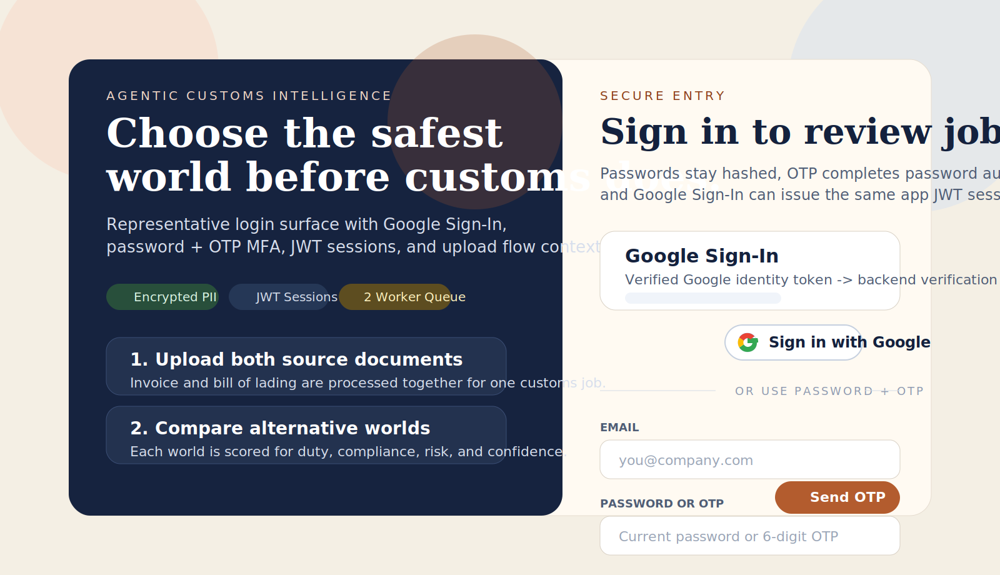
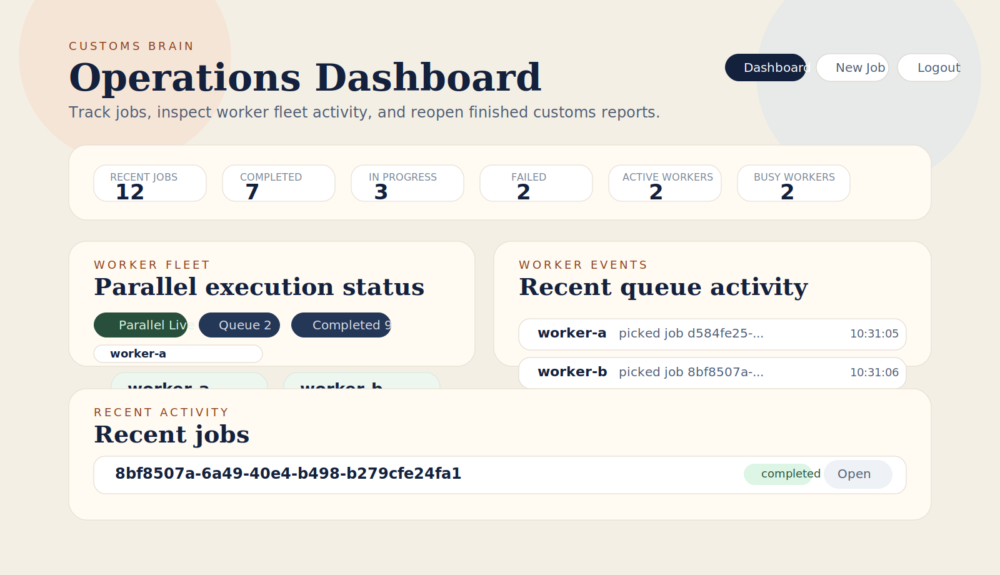
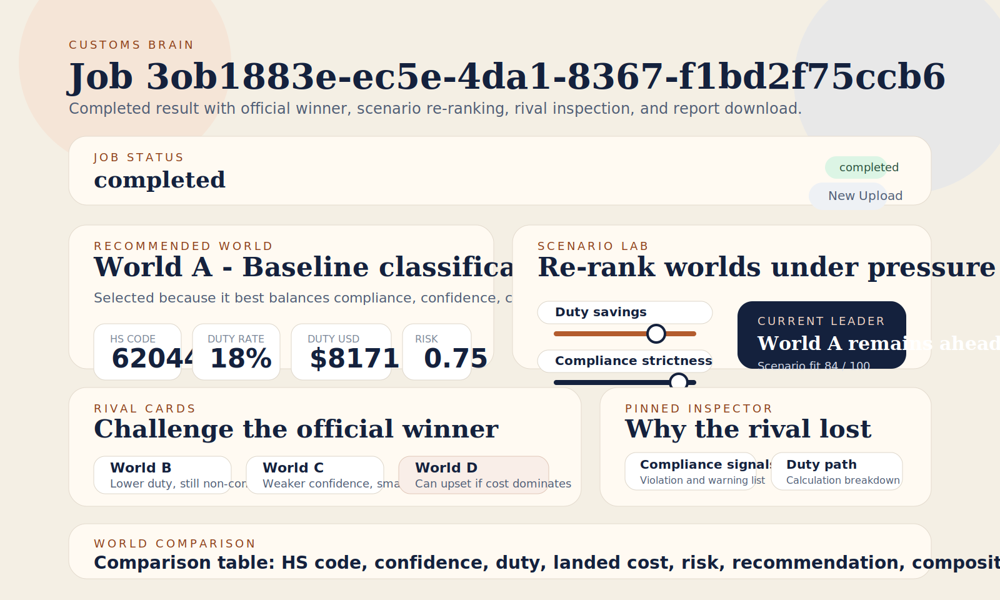
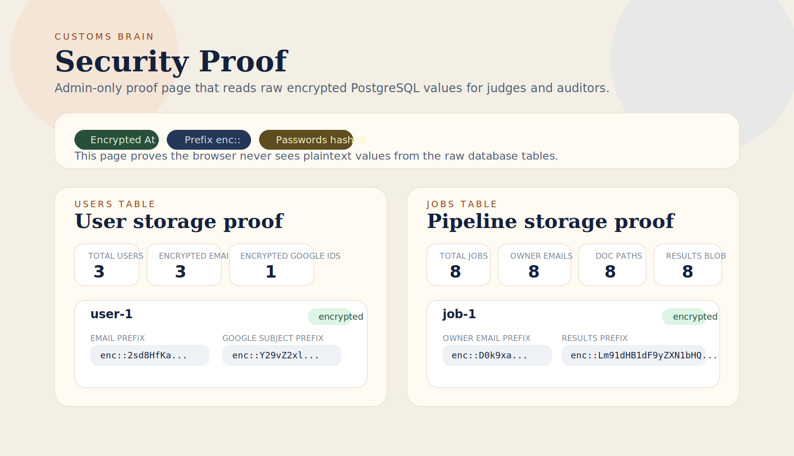
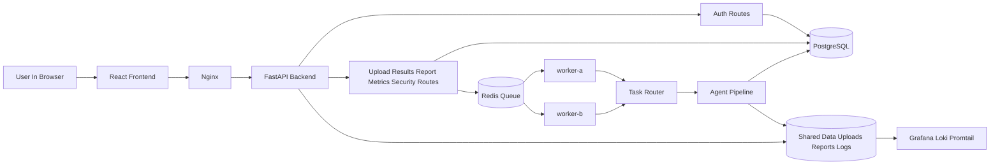
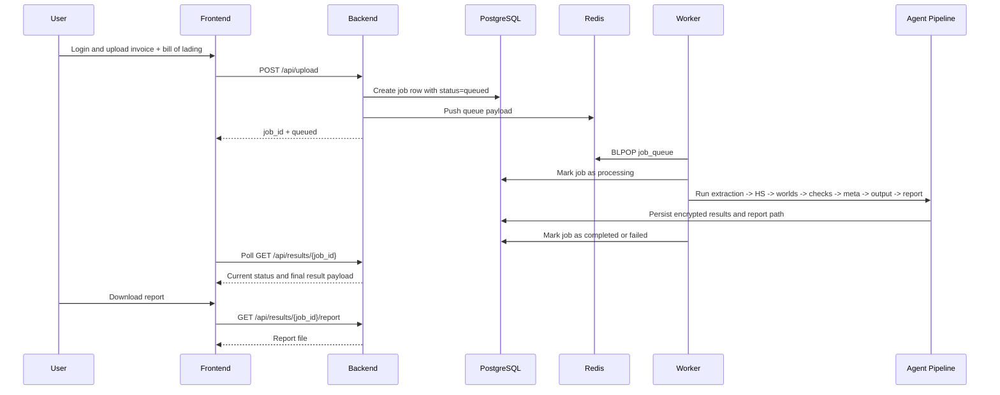

# Customs Brain

Customs Brain is a queue-backed, multi-agent customs intelligence platform that turns a shipment upload into a ranked customs recommendation, alternative HS-classification worlds, report-ready reasoning, and an admin-verifiable security story.

The platform is designed to show three things clearly:

1. The product value: upload two shipping documents and get a decision-ready customs recommendation.
2. The systems value: long-running AI work is handled by parallel workers, not inline inside the API.
3. The engineering value: authentication, RBAC, encrypted storage, request tracing, observability, and database proof pages are built into the product instead of being bolted on later.

---

## Table Of Contents

- [What The Product Does](#what-the-product-does)
- [Core Capabilities](#core-capabilities)
- [Representative Screens](#representative-screens)
- [Architecture Diagram](#architecture-diagram)
- [End-To-End Flow](#end-to-end-flow)
- [Why Redis And Workers Exist](#why-redis-and-workers-exist)
- [Agent Pipeline](#agent-pipeline)
- [Authentication And Security](#authentication-and-security)
- [Data Storage Model](#data-storage-model)
- [API Surface](#api-surface)
- [Tech Stack](#tech-stack)
- [Repository Layout](#repository-layout)
- [Quick Start With Docker](#quick-start-with-docker)
- [Local Development](#local-development)
- [Environment Variables](#environment-variables)
- [Testing And Verification](#testing-and-verification)
- [Judge Or Demo Walkthrough](#judge-or-demo-walkthrough)
- [Troubleshooting](#troubleshooting)
- [Supporting Docs](#supporting-docs)

---

## What The Product Does

Trade teams usually make customs decisions by stitching together evidence from invoices, bills of lading, tariff logic, compliance rules, valuation signals, and human judgment. Customs Brain compresses that workflow into one system:

- The user uploads an invoice and a bill of lading.
- The backend creates a job and queues it.
- Workers pull queued jobs and execute the AI pipeline asynchronously.
- The pipeline extracts shipment context, generates multiple customs worlds, evaluates each world, ranks them, and produces a final recommendation.
- The frontend presents the official winner, alternatives, evidence, worker activity, and downloadable report output.

At a glance, this project is both:

- a customs decision-support product
- a full-stack systems demo of async architecture, security, and observability

---

## Core Capabilities

### Product Features

- Upload-driven shipment review using an invoice and bill of lading
- Multiple alternative customs worlds for the same shipment
- HS code recommendation plus alternatives
- Duty, landed cost, compliance, confidence, and critic reasoning per world
- Plain-language summary and downloadable report
- Interactive scenario lab for re-ranking worlds under different priorities
- Rival world inspector with evidence and tradeoff details

### Platform Features

- FastAPI backend with JWT auth
- Password + OTP MFA login
- Optional Google Sign-In using Google Identity Services ID tokens
- Access token + refresh token flow
- Admin vs general-user RBAC
- Redis queue for asynchronous jobs
- Two parallel workers (`worker-a`, `worker-b`)
- Dashboard visibility into worker status and worker events
- PostgreSQL-backed persistence
- PII encryption at rest in the database
- Admin-only storage proof page for judges and auditors
- Structured logging with `service`, `request_id`, and `job_id`
- Optional Loki + Promtail + Grafana observability stack

---

## Representative Screens

The repository did not previously contain checked-in screenshots, so the README now includes repo-owned representative UI captures that mirror the current product layout and flow.

### Login



### Dashboard



### Results



### Security Proof



---

## Architecture Diagram



### Runtime Components

| Component | Responsibility |
|---|---|
| `frontend` | Login, upload, dashboard, results, and security proof UI |
| `backend` | Auth, upload, result retrieval, metrics, report download, and admin proof API |
| `redis` | Job queue transport between API and workers |
| `worker-a`, `worker-b` | Async queue consumers that execute the customs pipeline |
| `postgres` | Users, OTP challenges, job state, encrypted PII, and stored results |
| `nginx` | Optional reverse proxy for local stack routing |
| `grafana`, `loki`, `promtail` | Optional observability profile for logs |

---

## End-To-End Flow

### Job Lifecycle



### Authentication Modes

#### Password + OTP

1. Frontend submits email and password to `POST /api/auth/login`
2. Backend verifies the password hash
3. Backend creates an OTP challenge in PostgreSQL
4. OTP is delivered by SMTP or developer echo mode
5. Frontend submits code to `POST /api/auth/verify-otp`
6. Backend returns access and refresh tokens

#### Google Sign-In

1. Frontend loads Google Identity Services
2. Google returns an ID token in the browser
3. Frontend submits the token to `POST /api/auth/google`
4. Backend verifies issuer, audience, signature, expiry, and verified email
5. Backend links or creates the user and returns the same app JWT session shape used by password auth

---

## Why Redis And Workers Exist

This application intentionally does **not** run the heavy AI pipeline inside the upload request.

### Without A Queue

- `/upload` would block while the full pipeline runs
- API requests would stay open for too long
- concurrency would degrade quickly
- retries and worker scaling would be awkward
- the app would stop being a good systems demo

### With Redis + Workers

- the backend responds quickly with a `job_id`
- heavy processing runs out of band
- multiple workers can pick different jobs in parallel
- the dashboard can prove parallel execution visually
- failures are isolated to jobs instead of taking down the API request path

In this project:

- **Redis** is the waiting line
- **the backend** creates jobs and enqueues them
- **workers** pull jobs from Redis and do the actual work

---

## Agent Pipeline

The active processing chain is coordinated by the worker task router and agent modules.

### Pipeline Order

1. **Extraction**
2. **HS Code generation**
3. **World generation**
4. **Compliance evaluation**
5. **Valuation review**
6. **Duty calculation**
7. **Critic / debate**
8. **Meta scoring**
9. **Output formatting**
10. **Report generation**

### Agent Reference

| Stage | Primary Files | Responsibility |
|---|---|---|
| Extraction | `agents/extraction/agent.py` | Parse raw invoice and bill of lading text into structured shipment data |
| HS Code | `agents/hs_code/agent.py` | Produce candidate HS interpretations |
| World | `agents/world/agent.py`, `agents/world/builder.py` | Turn HS candidates into alternative customs worlds |
| Compliance | `agents/compliance/agent.py` | Evaluate compliance posture and applicable rules |
| Valuation | `agents/valuation/agent.py` | Review valuation signals and evidence |
| Duty | `agents/duty/agent.py` | Estimate duty and landed cost |
| Debate / Critic | `agents/debate/agent.py`, `agents/critic/agent.py` | Stress-test each world and surface critiques |
| Meta | `agents/meta/agent.py`, `agents/meta/scorer.py` | Score and rank the worlds |
| Output | `agents/output/agent.py` | Build the result payload used by the frontend |
| Report | `agents/report/agent.py` | Generate report output for download |

### Worker Routing

The async worker entrypoint is:

- [workers/worker.py](workers/worker.py)

The pipeline handoff logic is:

- [workers/queue/task_router.py](workers/queue/task_router.py)

---

## Authentication And Security

### Authentication

- Password login with hashed password storage
- One-time password challenge flow
- JWT access tokens
- JWT refresh tokens
- Optional Google Sign-In
- Admin and general-user roles

### Security Controls

- User emails encrypted at rest
- Google subject identifiers encrypted at rest
- OTP email values encrypted at rest
- Job owner email encrypted at rest
- Uploaded document paths encrypted at rest
- Generated report path encrypted at rest
- Stored result payload encrypted at rest
- Passwords stored as hashes, not reversible encryption

### Admin Security Proof Page

The app includes an admin-only screen at `/security` that proves storage security without asking judges to inspect SQL manually.

It shows:

- encrypted user email prefixes
- encrypted Google subject prefixes
- hashed password prefixes
- encrypted job owner email prefixes
- encrypted document path prefixes
- encrypted results blob prefixes

Relevant files:

- [backend/app/api/routes/security.py](backend/app/api/routes/security.py)
- [backend/app/services/security_service.py](backend/app/services/security_service.py)
- [frontend/src/pages/Security.jsx](frontend/src/pages/Security.jsx)

---

## Data Storage Model

### PostgreSQL Tables

| Table | Purpose |
|---|---|
| `users` | Application users, password hash, encrypted email, optional encrypted Google subject |
| `otp_challenges` | OTP verification flow and delivery metadata |
| `jobs` | Job status, encrypted owner email, encrypted file paths, encrypted result payload, encrypted report path |

### Filesystem Storage

The stack also uses shared data directories for:

- uploaded document files
- generated reports
- log files

Configured directories:

- `UPLOAD_DIR`
- `REPORT_DIR`
- `LOG_DIR`

### Migrations

The repo uses lightweight startup migration helpers instead of a full migration framework.

- [backend/app/db/auth_migrations.py](backend/app/db/auth_migrations.py)
- [backend/app/db/sensitive_migrations.py](backend/app/db/sensitive_migrations.py)

These startup migrations:

- add newer auth schema fields
- re-encrypt legacy plaintext values
- support legacy PII keys during transition

---

## API Surface

### Auth

| Method | Route | Purpose |
|---|---|---|
| `POST` | `/api/auth/login` | Start password login and issue OTP challenge |
| `POST` | `/api/auth/verify-otp` | Verify OTP and issue app JWT tokens |
| `POST` | `/api/auth/refresh` | Refresh an access token from a refresh token |
| `POST` | `/api/auth/google` | Complete Google Sign-In using an ID token |
| `GET` | `/api/auth/providers` | Return enabled auth providers and Google client ID exposure for frontend setup |
| `GET` | `/api/auth/me` | Return the current authenticated user |

### Job And Output APIs

| Method | Route | Purpose |
|---|---|---|
| `POST` | `/api/upload` | Upload invoice and bill of lading, create queued job |
| `GET` | `/api/results/{job_id}` | Poll for current job status and result payload |
| `GET` | `/api/results/{job_id}/report` | Download generated report output |
| `GET` | `/api/metrics/pipeline` | View worker activity and queue metrics |
| `GET` | `/api/security/storage` | Admin-only raw encrypted storage proof |
| `GET` | `/health` | Service health check |

### Interactive Docs

- API docs: `http://localhost:8000/docs`

---

## Tech Stack

| Layer | Technology |
|---|---|
| Frontend | React, Axios, React Router |
| Backend | FastAPI |
| Worker Runtime | Python async worker |
| Queue | Redis |
| Database | PostgreSQL |
| Local DB Option | SQLite when `LOCAL_PIPELINE_MODE=true` |
| Auth | JWT, OTP, Google Identity Services |
| Encryption | Deterministic authenticated encryption for stored PII |
| Reporting | Markdown/report generation pipeline |
| Infra | Docker Compose, Nginx |
| Observability | Grafana, Loki, Promtail |

---

## Repository Layout

```text
customs-brain/
|- frontend/
|  |- src/
|  |  |- pages/
|  |  |- components/
|  |  |- services/
|- backend/
|  |- app/
|  |  |- api/routes/
|  |  |- services/
|  |  |- db/
|  |  |- core/
|- workers/
|  |- queue/
|  |- tasks/
|- agents/
|  |- extraction/
|  |- hs_code/
|  |- world/
|  |- compliance/
|  |- valuation/
|  |- duty/
|  |- debate/
|  |- critic/
|  |- meta/
|  |- output/
|  |- report/
|- infra/
|  |- nginx/
|  |- observability/
|- docs/
|  |- assets/screens/
|- scripts/
|- tests/
```

### Key Files

| File | Why It Matters |
|---|---|
| [backend/app/main.py](backend/app/main.py) | FastAPI app startup, route registration, middleware, startup migrations |
| [backend/app/services/auth_service.py](backend/app/services/auth_service.py) | Password, OTP, JWT, Google auth, RBAC helpers |
| [backend/app/services/job_service.py](backend/app/services/job_service.py) | Job creation, metrics, and worker status aggregation |
| [workers/worker.py](workers/worker.py) | Queue consumer, heartbeat publishing, job execution |
| [workers/job_store.py](workers/job_store.py) | Worker-side persistence of job state |
| [workers/queue/task_router.py](workers/queue/task_router.py) | Orchestrates pipeline stages |
| [frontend/src/pages/Dashboard.jsx](frontend/src/pages/Dashboard.jsx) | Worker cards, parallel execution status, recent jobs |
| [frontend/src/pages/Results.jsx](frontend/src/pages/Results.jsx) | Winner details, scenario lab, rival cards, evidence inspector |
| [frontend/src/pages/Security.jsx](frontend/src/pages/Security.jsx) | Admin-only encrypted storage proof |

---

## Quick Start With Docker

### Prerequisites

- Docker Desktop
- Docker Compose
- At least one LLM API key, typically `OPENAI_API_KEY`

### 1. Create Local Environment

Copy the template:

```bash
cp .env.example .env
```

On Windows PowerShell:

```powershell
Copy-Item .env.example .env
```

### 2. Populate Required Variables

At minimum, set:

- `OPENAI_API_KEY`
- `SECRET_KEY`
- `PII_ENCRYPTION_KEY`
- `POSTGRES_USER`
- `POSTGRES_PASSWORD`
- `POSTGRES_DB`

Optional but recommended:

- `ADMIN_EMAIL`
- `ADMIN_PASSWORD`
- `GENERAL_USER_EMAIL`
- `GENERAL_USER_PASSWORD`
- `GOOGLE_CLIENT_ID`
- `GOOGLE_ALLOWED_DOMAIN`

### 3. Start The Stack

```bash
docker compose up --build
```

### 4. Open The Services

- Frontend: `http://localhost:3000`
- Backend docs: `http://localhost:8000/docs`
- Backend health: `http://localhost:8000/health`
- Nginx edge: `http://localhost`

### 5. Optional Observability Profile

```bash
docker compose --profile observability up -d loki promtail grafana
```

Then open:

- Grafana: `http://localhost:3001`

---

## Local Development

### Important Note

Even when `LOCAL_PIPELINE_MODE=true`, job execution still uses the queue-backed model. Uploads do **not** run inline in the backend anymore. Redis and a worker are still required.

### Backend

```powershell
pip install -r backend/requirements.txt
powershell -ExecutionPolicy Bypass -File .\scripts\run_backend.ps1
```

### One Worker

```powershell
powershell -ExecutionPolicy Bypass -File .\scripts\run_worker.ps1
```

### Two Workers

```powershell
powershell -ExecutionPolicy Bypass -File .\scripts\run_two_workers.ps1
```

### Frontend

```powershell
cd frontend
npm install
npm start
```

### Useful Local Scripts

| Script | Purpose |
|---|---|
| `scripts/run_backend.ps1` | Start the backend locally |
| `scripts/run_worker.ps1` | Start one worker locally |
| `scripts/run_two_workers.ps1` | Start `worker-a` and `worker-b` locally |
| `scripts/smoke_test_flow.ps1` | End-to-end upload and polling smoke test |
| `scripts/run_local_pipeline.py` | Local pipeline runner |
| `scripts/seed.py` | Seed or setup helper script |

---

## Environment Variables

### Core Runtime

| Variable | Description |
|---|---|
| `DATABASE_URL` | Optional full async SQLAlchemy database URL |
| `REDIS_URL` | Redis connection URL |
| `SHARED_DATA_DIR` | Root shared runtime data directory |
| `UPLOAD_DIR` | Uploaded document storage path |
| `REPORT_DIR` | Generated report storage path |
| `LOG_DIR` | Shared log path |
| `LOCAL_PIPELINE_MODE` | Local-mode defaults toggle |
| `LOCAL_DB_PATH` | SQLite path when local DB mode is used |

### Security And Auth

| Variable | Description |
|---|---|
| `SECRET_KEY` | JWT signing secret |
| `PII_ENCRYPTION_KEY` | Primary encryption key for stored PII |
| `PII_ENCRYPTION_LEGACY_KEYS` | Optional legacy keys for decrypt-and-reencrypt migrations |
| `ACCESS_TOKEN_EXPIRE_MINUTES` | Access token lifetime |
| `REFRESH_TOKEN_EXPIRE_DAYS` | Refresh token lifetime |
| `OTP_EXPIRE_MINUTES` | OTP expiration window |
| `OTP_LENGTH` | OTP length |
| `AUTH_DEBUG_OTP_ECHO` | Developer OTP echo mode |
| `ADMIN_EMAIL` | Seeded admin email |
| `ADMIN_PASSWORD` | Seeded admin password |
| `GENERAL_USER_EMAIL` | Seeded general user email |
| `GENERAL_USER_PASSWORD` | Seeded general user password |

### Google Sign-In

| Variable | Description |
|---|---|
| `GOOGLE_CLIENT_ID` | Web client ID used by Google Identity Services |
| `GOOGLE_ALLOWED_DOMAIN` | Optional hosted-domain restriction |

### SMTP

| Variable | Description |
|---|---|
| `SMTP_HOST` | SMTP server host |
| `SMTP_PORT` | SMTP port |
| `SMTP_USERNAME` | SMTP username |
| `SMTP_PASSWORD` | SMTP password or app password |
| `SMTP_FROM_EMAIL` | Email sender address |
| `SMTP_USE_TLS` | Toggle STARTTLS |

### Postgres / Grafana

| Variable | Description |
|---|---|
| `POSTGRES_USER` | Postgres username |
| `POSTGRES_PASSWORD` | Postgres password |
| `POSTGRES_DB` | Postgres database name |
| `GF_SECURITY_ADMIN_USER` | Grafana admin username |
| `GF_SECURITY_ADMIN_PASSWORD` | Grafana admin password |

### Model Providers

| Variable | Description |
|---|---|
| `OPENAI_API_KEY` | Primary OpenAI API key |
| `ANTHROPIC_API_KEY` | Optional Anthropic API key |
| `GROQ_API_KEY` | Optional Groq API key |
| `GROQ_MODEL` | Groq model name |
| `GROQ_OCR_MODEL` | Groq OCR model name |
| `XAI_API_KEY` | Optional xAI API key |
| `XAI_MODEL` | xAI model name |

---

## Testing And Verification

### Python Tests

```powershell
pytest -q
```

### Focused Auth / Worker Tests

```powershell
pytest tests\unit\test_auth_security.py tests\unit\test_worker.py -q
```

### Frontend Production Build

```powershell
cd frontend
npm run build
```

### End-To-End Smoke Test

```powershell
powershell -ExecutionPolicy Bypass -File .\scripts\smoke_test_flow.ps1
```

The smoke test validates:

- backend health
- upload path
- result polling
- report download

---

## Judge Or Demo Walkthrough

Use this flow when presenting the system end to end.

### 1. Show Login

- Explain password + OTP
- Explain optional Google Sign-In
- Mention JWT access and refresh token model

### 2. Show Upload

- Upload invoice and bill of lading
- Explain that the API only queues the job

### 3. Show Dashboard

- Point out `worker-a` and `worker-b`
- Show `Parallel Ready` or `Parallel Live`
- Explain that Redis is the queue and workers pull from it independently

### 4. Show Results

- Open the finished job
- Show the official winner
- Show alternative worlds
- Move the scenario sliders
- Click rival cards and inspector evidence
- Download the report

### 5. Show Security Proof

- Open `/security` as admin
- Show encrypted `enc::` values from PostgreSQL
- Show that passwords are hashed
- Explain that the normal app decrypts only when needed, while the DB stores ciphertext at rest

This sequence demonstrates:

- product usability
- async architecture
- parallel workers
- real pipeline evidence
- database security

---

## Troubleshooting

### Google Button Does Not Show

- Verify `GOOGLE_CLIENT_ID` is set in `.env`
- Restart the backend and frontend
- Check `GET /api/auth/providers`
- Make sure your Google web client is configured for local origins such as `http://localhost` and `http://localhost:3000`

### Uploads Stay Queued

- Confirm Redis is running
- Confirm at least one worker is running
- Check dashboard worker cards
- Inspect worker logs

### Dashboard Shows No Workers

- Start `worker-a` and `worker-b`
- Confirm Redis connectivity
- Check worker heartbeat publishing

### `/security` Returns 403

- Log in as the admin user configured by `ADMIN_EMAIL`
- General users do not have access to the admin storage proof route

### Network Error In Frontend

- Confirm backend health at `/health`
- Confirm frontend is calling the correct API base
- Refresh the browser after restarting services

### Invalid Access Token

- Log out and log back in
- Let the frontend refresh token flow re-issue an access token
- Clear local storage if the browser still holds stale session state

---

## Supporting Docs

- [docs/architecture.md](docs/architecture.md)
- [docs/agents.md](docs/agents.md)
- [docs/api.md](docs/api.md)
- [docs/setup.md](docs/setup.md)

---

## Summary

Customs Brain is more than a model demo. It is a full-stack async application that combines:

- a useful customs decision workflow
- a visible multi-worker queue architecture
- secure authentication and encrypted storage
- an admin-verifiable audit story
- a frontend that explains the reasoning instead of hiding it

If you want to present one repository that shows product thinking, AI orchestration, backend systems design, and security engineering together, this is the point of the project.
